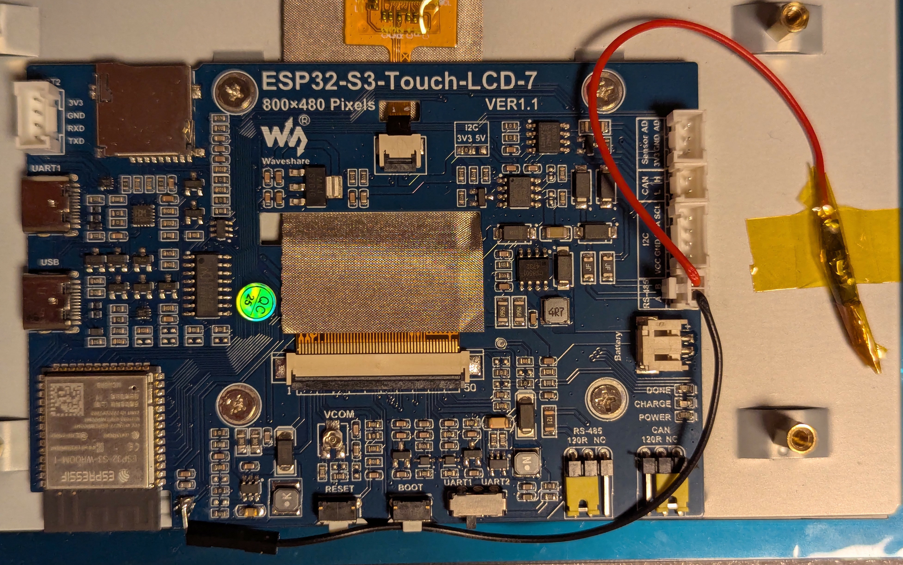

# The Package

This is an [ESPHome package](https://esphome.io/components/packages) for the [waveshare-esp32-s3-touch-lcd-7](https://www.waveshare.com/wiki/ESP32-S3-Touch-LCD-7) display. The main idea is that all the boilerplate code is already done in the package and you can focus on the logic that makes your project special.

The package will:
- setup the correct esp32 and esphome settings
- setup the display and touchscreen
- add an empty `lvgl` component
- add a `light.lcdbacklight` and a `switch.antiburn`
- automatically run the antiburn protection when the backlight is off
- exposes the LCD Backlight light and Antiburn switch as disabled switches to Home Assistant

You can then add your own sensors and `lvgl` setup.

The package requires ESPHome version 2025.4.2 or greater, because I've not tested it with any older versions.

# Usage

- Load the [`waveshare-esp32-s3-touch-lcd-7.yaml` file](waveshare-esp32-s3-touch-lcd-7.yaml) as described in the [ESPHome documentation](https://esphome.io/components/packages) (or see the [`clock.yaml` demo](demo/clock.yaml)).
- Add any sensors you want.
- Add `lvgl` widgets.
- Make sure to turn off the `light.lcdbacklight` once in a while for at least 30 min, so that the antiburn protection can do its thing.

# Controlling the display brightness

If you want to control the brightness of the display you'll need to do some soldering. There's a testpoint thatneeds to be soldered to a ESP32 pin. See [this thread](https://community.home-assistant.io/t/esp32-s3-7inch-capacitive-touch-display-adjust-brightness/771030) for how to do that. 

Here's my attempt (__make sure the red wire is isolated, to prevent a shortciruit!__ I've taped it off with electric tape.)

Once you've done that you can use the [`waveshare-esp32-s3-touch-lcd-7-brightness.yaml` file](waveshare-esp32-s3-touch-lcd-7-brightness.yaml) instead, and you'll be able to to adapt the brightness of you display. See the [`clock-brightness.yaml` demo](demo/clock-brightness.yaml) for an example.

The `brightness` file has three variables you can set:
- `backlight_brightness_pin`: defaults to `GPIO16`, which is the one I've used in the image above. If you have  soldered the testpoint to another pin you'll need to give the correct one here.
- `initial_brightness`: Set the brightness of the display on boot (float between `0.0` and `1.0`, defaults to `0.8`).
- `min_power`: I've noticed that my display will be dark for a large part of the brightness range, to fix this I set this variable (float between `0.0` and `1.0`, defaults to `0.07`).

If you set these variables make sure to quote the floats, else things might break.

Using the brightness file adds a new `light.lcdbacklight_brightness` now you can use this to change the backlight brightness and turn on/off the backlight. You __don't__ need to care about `light.lcdbacklight` anymore and can keep it on all the time.

The exposed LCD Backlight in Home Assistant will now also allow you to change the brightness of the display.
